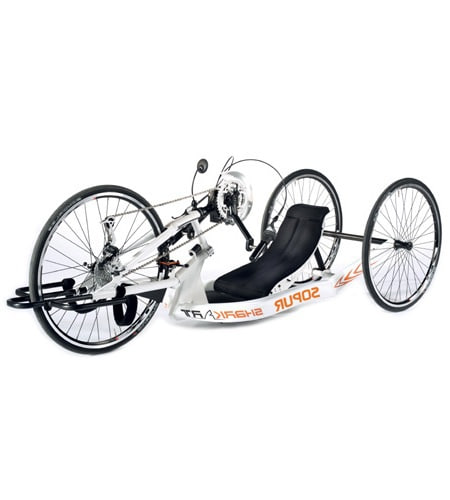
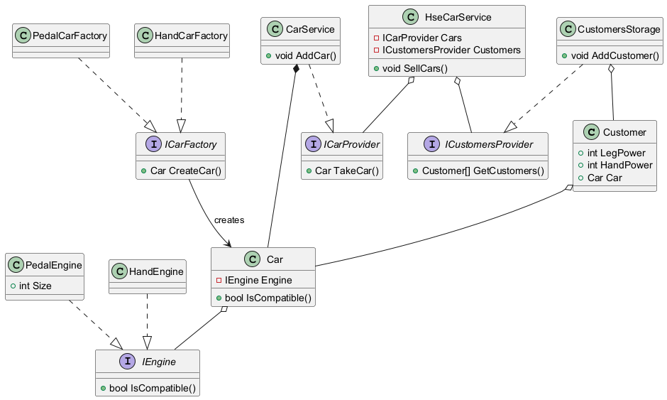

# Семинар #2: Принципы SOLID

*Выпускаемые НИУ ВШЭ автомобили с педальными двигателями пользуются большим спросом, но иногда встречаются люди, которые не могут использовать новый тип автомобиля - их ноги слишком слабые,
чтобы крутить педали с достаточной силой. Но студенты нашли решение для этой проблемы, выпустив новый тип двигателя - с ручным приводом. Теперь больше людей могут приобрести автомобили,
выпускаемые НИУ ВШЭ. Студенты обратились к вам для доработки информационной системы под новые реалии.*

## Функциональные требования

1. Информационная система должна учитывать автомобили с обоими типами двигателей
2. Автомобили с педальным приводом необходимо продавать покупателям с силой ног больше 5
3. Автомобили с ручным приводом необходимо продавать покупателям с силой рук больше 5

## Требования к реализации

1. В класс `Customer` добавить две новые характеристики:
    - Целое число, определяющее силу ног покупателя
    - Целое число, определяющее силу рук покупателя
2. Добавить интерфейс `IEngine` для описания двигателя:
    - У двигателя должен быть метод, позволяющий проверить совместимость между двигателем и покупателем
3. Класс `Engine` переименовать в `PedalEngine` и добавить реализацию интерфейса `IEngine`:
    - При реализации метода определения совместимости двигателя и покупателя учесть функциональные требования
4. Добавить реализацию интефейса `IEngine` для двигателя с ручным приводом:
    - При реализации метода определения совместимости двигателя и покупателя учесть функциональные требования
5. Для каждой реализации интерфейса `IEngine` переопределить метод `ToString` для получения информации о двигателе:
    - Метод должен возвращать тип двигателя
6. Заменить ссылку на `Engine` внутри класса `Car` на ссылку на интерфейс `IEngine`:
    - Определить конструктор, принимающий экземпляр `IEngine` и номер автомобиля
7. Добавить в класс `Car` метод для определения совместимости автомобиля с покупателем:
    - Внутри метода использовать соответствующий метод интерфейса `IEngine`
8. Добавить generic-интерфейс `ICarFactory` для создания автомобилей:
    - У интерфейса должен быть один generic-параметр `TParams`, предназначенный для параметров двигателя
    - У интерфейса должен быть метод для создания автомобилей:
        - Метод должен принимать параметр типа `TParams`
        - Метод должен принимать номер выпускаемого автомобиля
9. Добавить класс `PedalEngineParams`:
    - Класс должен иметь свойство для педачи размера педалей
10. Добавить структуру `EmptyEngineParams`:
    - У структуры определить статическое поле `DEFAULT`, содержащее экемпляр структуры
11. Реализовать интерфейс `ICarFactory` для педальных автомобилей:
    - Класс должен называться `PedalCarFactory`
    - При реализации интерфейса в качестве аргумента для generic-параметра использовать класс `PedalEngineParams`
12. Реализовать интерфейс `ICarFactory` для автомобилей с ручным приводом:
    - Класс должен называться `HandCarFactory`
    - При реализации интерфейса в качестве аргумента для generic-параметра использовать структуру `EmptyEngineParams`
13. Добавить интерфейс `ICarProvider`
    - У интерфейса должен быть метод для поиска подходящего автомобиля, принимающий ссылку на покупателя в качестве параметра
14. Добавить класс `CarService` для управления автомобилями:
    - У класса должна быть коллекция объектов `Car` для хранения автомобилей - при этом между автомобилями и `CarService` должно быть отношение композиции
    - Необходимо реализовать интерфейс `ICarProvider` для класса `CarService`:
        - Метод должен пробегаться по коллекции автомобилей и возвращать первый подходящий автомобиль
        - При реализации учесть, что каждый автомобиль должен быть выдан ровно 1 раз
    - У класса должен быть generic-метод для добавления автомобилей:
        - В качестве generic-параметра должен выступать тип `TParams` для описания параметров двигателя добавляемого автомобиля
        - Метод должен принимать параметр типа `ICarFactory`
        - Также метод должен принимать параметр типа `TParams`
        - В своем теле метод должен вычислять номер выпущенного автомобиля - они не должны повторяться
15. Добавить интерфейс `ICustomersProvider`:
    - Интерфейс должен содержать метод для получения списка покупателей
16. Добавить класс `CustomerStorage`
    - У класса должна быть коллекция покупателей
    - Класс должен реализовывать интерфейс `ICustomersProvider`
    - У класса должен быть метод для добавления покупателей
17. Удалить класс `HseCarFactory`
18. Добавить класс `HseCarService`:
    - Добавить ссылки на интерфейсы `ICarProvider` и `ICustomersProvider` - проинициализировать их через конструктор класса
    - Добавить метод `SellCars`:
        - Метод должен получить покупателей из `ICustomersProvider` и пробежаться по списку
        - Если у какого-то покупателя нет автомобиля - метод должен запрашивать автомобиль из `ICarProvider`
        - Если автомобиль удалось получить - метод должен назначать его покупателю

## Тестирование

1. Создать экезмпляр класса `CarService`
2. Создать экземпляр класса `CustomerStorage`
3. Создать экземпляр класса `HseCarService`
4. Создать экземпляр класса `PedalCarFactory`
5. Создать экземпляр класса `HandCarFactory`
6. Добавить следующих покупателей:
    - С силой ног 6 и силой рук 4
    - С силой ног 4 и силой рук 6
    - С силой ног 6 и силой рук 6
    - С силой ног 4 и силой рук 4
7. Добавить автомобили:
    - 2 педальных автомобиля
    - 2 автомобиля с ручным приводом
8. Вывести на экран информацию о покупателях и их автомобилях
9. Вызвать метод `SellCars`
10. Вывести на экран информацию о покупателях и их автомобилях. Проверить, что результат соответствует следующему:
    - Одному покупателю вручен педальный автомобиль
    - Одному покупателю вручен автомобиль с ручным приводом
    - Одному покупателю вручен любой автомобиль
    - Один покупатель остался без автомобиля
    - При этом у всех врученных автомобилей различные номера

## Пояснения к реализации

Добавление интерфейса `IEngine`, объединяющего под собой все возможные двигатели, позволяет реализовать принцип подстановки Лисков.
Прием в методе класса `CarService` интерфейса `ICarFactory`, а также параметров для него позволяет нам реализовать принцип открытости-закрытости.
Выделение интерфейсов `ICarProvider` и `ICustomersProvider`, содержащих лишь необходимую часть функциональности, позволило нам реализовать принцип разделения интерфейсов.
Вынесение управления автомобилями и покупателями из `HseCarService` позволило нам реализовать принципы единственной ответственности и инверсии зависимостей.

## Диаграмма классов полученной информационной системы

Старая версия задачи

# Семинар #2: Принципы SOLID (СТАРАЯ ВЕРСИЯ)

*Выпускаемые НИУ ВШЭ автомобили с педальными двигателями пользуются большим спросом, но иногда встречаются люди, которые не могут использовать новый тип автомобиля - их ноги слишком слабые,
чтобы крутить педали с достаточной силой. Но студенты нашли решение для этой проблемы, выпустив новый тип двигателя - с ручным приводом. Теперь больше людей могут приобрести автомобили,
выпускаемые НИУ ВШЭ. Студенты обратились к вам для доработки информационной системы под новые реалии.*

## Функциональные требования

1. Информационная система должна учитывать автомобили с обоими типами двигателей
2. Автомобили с педальным приводом необходимо продавать покупателям с силой ног больше 5
3. Автомобили с ручным приводом необходимо продавать покупателям с силой рук больше 5

## Требования к реализации

1. Добавить интерфейс `IEngine` для описания двигателя. Двигатель должен сообщать свой тип, а также у покупателя должна иметь возможность понять, подходит ли ему данный тип двигателя
2. Добавить две реализации интефейса `IEngine` - для педального двигателя и для двигателя с ручным приводом. При этом педальный всё также должен иметь размер педалей
3. За счет реализации паттерна "Фабрика" добавить возможность для класса `Car` иметь внутри любой из двух типов двигателя, при этом не теряя композицию с объектом двигателя
4. Добавить класс `CarWarehouse` - он будет принимать машины из различных цехов и поставлять их в автомобильный салон
5. Реализовать принцип сегрегации интерфейсов для класса `CarWarehouse`. Отдельно должны осуществляться операции приема автомобилей из цехов и поставка их в автомобильный салон
6. Добавить классы `PedalCarFactory` и `HandCarFactory`, описывающие соответственно цеха по производству автомобилей с педальным и ручным двигателями
7. В добавленных классах цехов реализовать агрегацию с интерфейсом класса `CarWarehouse`, отвечающим за добавление машин на склад
8. В классах цехов добавить методы для создания автомобилей
9. Добавить класс `CustomerStorage` - он будет вести учет покупателей
10. Реализовать принцип сегрегации интерфейсов для класса `CustomerStorage`. Отдельно должны осуществляться операции добавления покупателей и их получения из хранилища
11. Класс `HseCarFactory` необходимо переименовать в `HseCarShop`.
12. Функционал по хранению автомобилей и покупателей удалить и заменить на агрегацию с частями `CustomerStorage` и `CarWarehouse`, отвечающими за получение данных.
13. Метод `SaleCar` класса `HseCarShop` перед продажей должен проверять, подходит ли автомобиль покупателю

